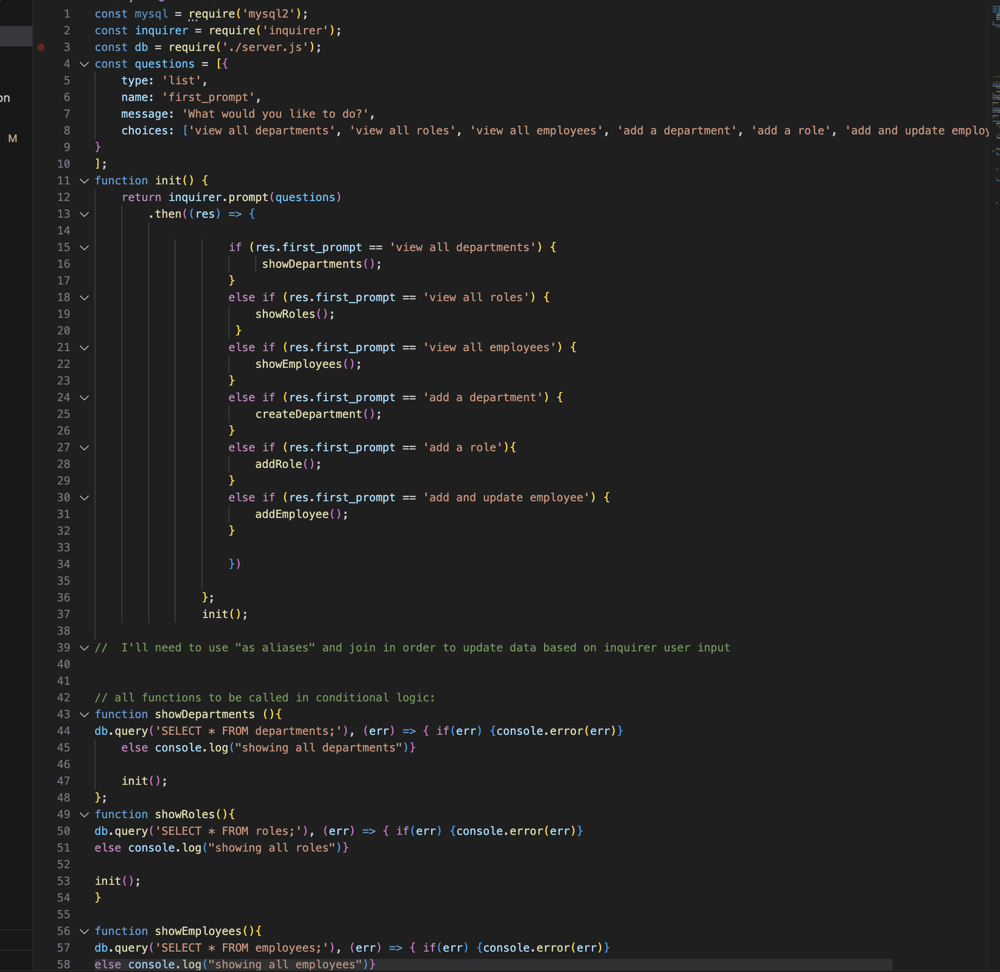
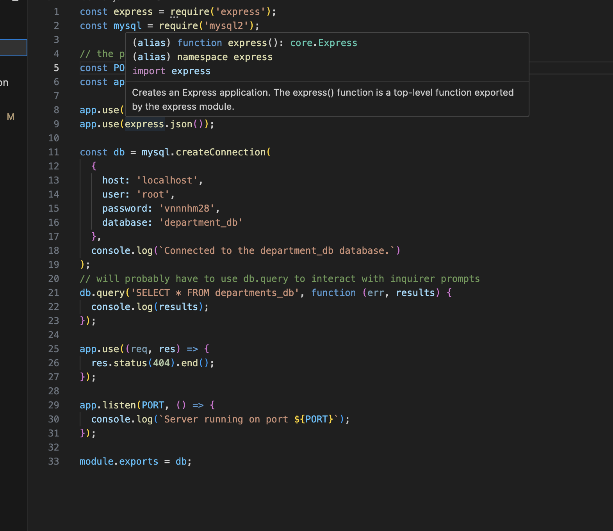
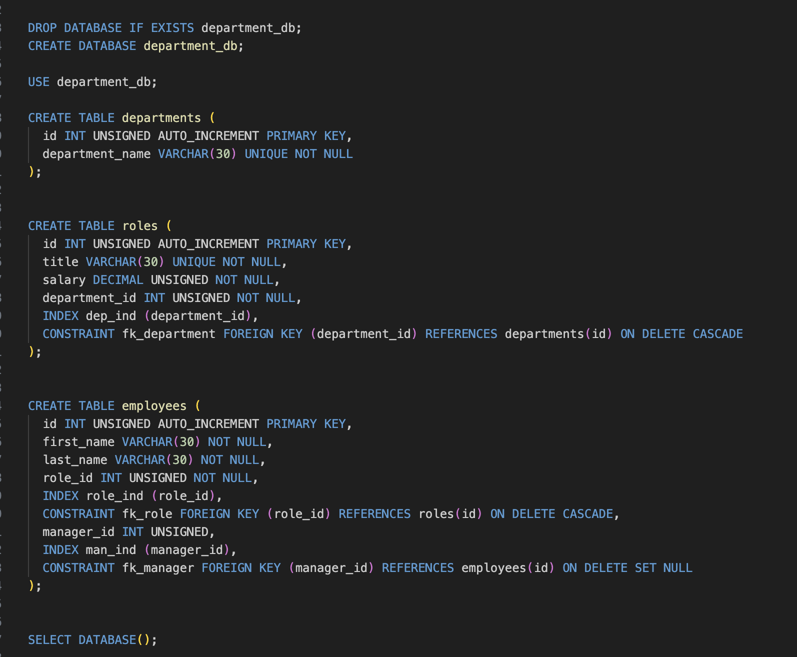

# sql_department_database

## Description
Using inquirer, express.js, and mysql2, you can populate a database titled departmnets_db. Using the command line, a user can view all departments, roles, and employees, as well as add roles, employees and departments based on user input. 

## Usage
Use mysql to launch the schema.sql and seeds.sql database files, then use node.js to launch the index.js in the terminal--command: "node index.js". You will then be prompted with a lst of options: view departments, view roles, view employees, add department, add role, add employee. Use the arrow keys to toggle between options and then input your response. 

## credits
This porject was completed by Aaron Styza.

## License
MIT license.

## Features
You can quickly use this application to easily manage a secure department database, add roles, salary information, managing staff, and other departmental data conveniently laid out in tables to reference.

## Prject Images

## Contributions
This project is not taking further contributions at this time.
